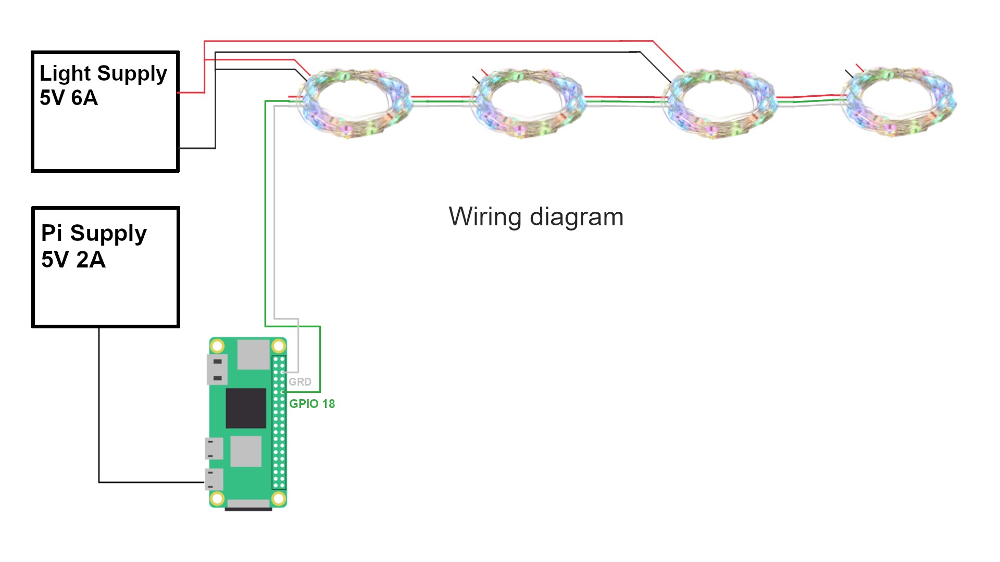
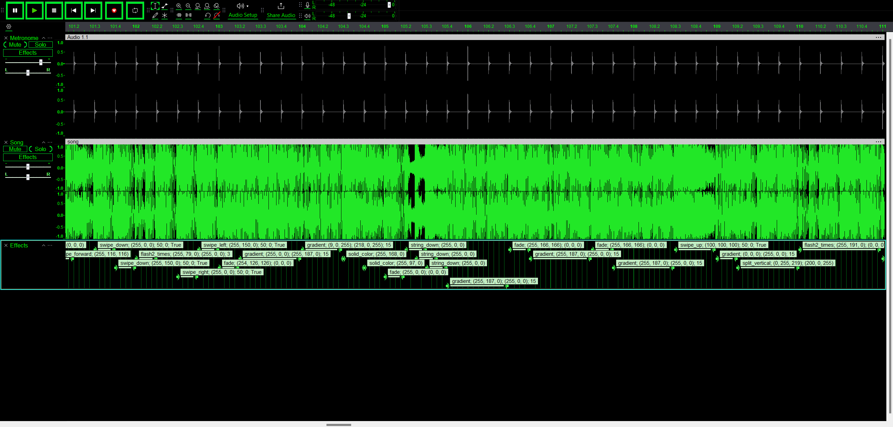

# Addresable Christmas Lights mapped in 3D space, controllable with an app
This project is a fun way to spice up your Christmas tree with dynamic effects. 3D Coordinates of all LEDs were calculated, allowing for effects to not only use the string, but each individual LED position in space. All effects are written in python and stored on a server, where they are automatically loaded and can be switched in an app. Each effect can easily set its own parameters, which are changable in the app and are remembered for the next time the effect is loaded.

<iframe width="560" height="315" src="https://www.youtube.com/embed/lzU8-Y6aO1Q?si=VccYeiQuKVHG6sh5" title="YouTube video player" frameborder="0" allow="accelerometer; autoplay; clipboard-write; encrypted-media; gyroscope; picture-in-picture; web-share" referrerpolicy="strict-origin-when-cross-origin" allowfullscreen></iframe>

This repository will show you everything you need to know and contains all scripts I used to make these lights, **including effect library, a tree simulator for testing, 3D space calculation and lightshow parsing scripts.**

# Hardware - My setup
I used 4x [addressable 50 LED WS2811B strings I got from Amazon](https://www.amazon.co.uk/dp/B08LKPF2PX) and a Raspberry Pi Zero 2W to control the lights and to run the server. The Raspberry Pi is powered with my old 5V 2A phone charger, and connected to the lights with GRD and GPIO18 for data. The lights are powered with my fast phone charger, delivering up to 6A. The lights are connected in series, with the first string connected to the Raspberry Pi and the power supply being connected to the first and third string. (This is necessary, as the last light string would be dimmer.)



The wiring diagram shown on their store page is also showing a 5V connection to the pi, but it's not necessary here.

# Server
The server is running on the Raspberry Pi and is written in Python using Flask. It serves the app and the effects, and is also responsible for the communication with the lights. The server is running on port 5000 and can be accessed from any device in the same network. It automatically loads all effects from the effects folder and shows them in a dropdown in the app. The app is also served by the server and is written in HTML and JavaScript. It uses the fetch API to communicate with the server and to load the effects, which are running in a separate thread, so the app is still responsive.

# Effects
## Effect library
Example of an effect:
```python
from effects.base_effect import LightEffect, ParamType
import random

class Sparkles(LightEffect):
    def __init__(self, pixels, coords):
        super().__init__(pixels, coords)
        # add the parameters
        self.color = self.add_parameter("Color", ParamType.COLOR, "#FF0000"),
        self.speed = self.add_parameter("Speed", "slider", 20, min=1, max=100, step=1)
        self.amount = self.add_parameter("Amount", "slider", 1, min=1, max=10, step=1)
        self.states = [0] * len(self.pixels)

    def update(self):
        off_lights = []
        for i in range(len(self.pixels)):
            if self.states[i] == 0:
                off_lights.append(i)
        # randomly select amount of lights to turn on
        for _ in range(int(self.amount.get())):
            if len(off_lights) < 50:
                break
            pick = random.choice(off_lights)
            self.states[pick] = 1
            off_lights.remove(pick)
        for i in range(len(self.pixels)):
            if self.states[i] > 0:
                self.states[i] -= self.speed.get() / 1000
            if self.states[i] < 0:
                self.states[i] = 0
            self.pixels[i] = [int(channel) * self.states[i] for channel in self.color[0].get()]
        self.pixels.show()
```

This effect is a simple sparkles effect, where a random amount of lights are turned on and fade out. The effect has 3 parameters: Color, Speed and Amount. The effect is updated as fast as the hardware allows it.

For more information on how to write effects, see the [effect library documentation](docs/server_effect.md).

## Mathutils
I made a few handy math functions for limiting values, linear interpolation, color gradients and so on. For more information, see the [mathutils documentation](docs/mathutils.md).

## Tree simulator
I also made a tree simulator using pyvista, which can be used to test effects without the lights. It places random points in a cone shape and passes the coordinates. The tree simulator runs the effects standalone and don't work with the server and thus, doesn't have parameters. For more information, see the [tree simulator documentation](docs/tree_simulator.md).

# 3D space calculation
I took an image of each individual LED from all four sides and wrote a script that found **the brightest pixel in the image** and converted it to 3D space. I got the XZ axis from from the front or back view, and the Y axis from one of the side views. The script picked the view with brighter brightest pixel. **This approach wasn't very effective** and I had to manually correct most of the points. If you are going to do this, **you might get better results using red or blue RGB channels of the image, not the brightness.**

# Lightshow
As the feature creep was intensifying, I decided to make another app that could allow to make a lightshow synced to a song. The app has a start button, which will play the song from the phone and will start the lightshow on the server. The lightshow is made with labels in Audacity, which are then saved into a .txt file with their start and end times, the effect and the arguments. I made about 9 effects, [which can be found here](lightshow/generate_lightshows.py). The labels are parsed, and the lightshow is stored into a pickle file as a dictionary, where the keys are the timestamps and values are arrays of colors corresponding to each LED. The lightshow is then played by the server, which will load the color states and play them at the right time.

