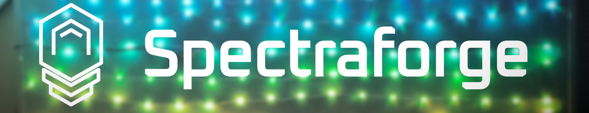

One app for all your light show needs! It offers space-aware effect and music driven light show capabilities. It dynamically loads effects, so you can create your own and it's built with a modular design using separate *engines*, making it easier to extend.

## Video Showcase 🎬

## Features ✨
- **Space-Aware Effects**: Create effects that light up according to the physical positions of the lights.
- **Easy Setup**: Point a webcam at the lights, refine detected positions and you're ready to go.
- **Pre-made music light shows**: Lay effects on a timeline and sync them with your favorite tracks.
- **Music Visualisation**: Automatic music light shows alternative, shows a classic bar visualisation of the music.
- **Canvas Mode**: Use the app as a canvas to draw your own expositions.
- **LED simulation**: View the state of the lights without any hardware connected when testing.

## Features for Developing 💻
- **Sandbox mode**: Hot reloading of effects on save, making them much easier to create and test.
- **Modular Design**: Built with an engine system, where each one manipulates the lights in a different way. Engine manager is responsible for dynamic enabling/disabling of engines, so only one engine is active at a time.

## Hardware - My setup ⚙️
I used 4x [addressable 50 LED WS2811B strings I got from Amazon](https://www.amazon.co.uk/dp/B08LKPF2PX) and a Raspberry Pi Zero 2W to control the lights and to run the server. The Raspberry Pi is powered with my old 5V 2A phone charger, and connected to the lights with GRD and GPIO18 for data. The lights are powered with my fast phone charger, delivering up to 6A. The lights are connected in series, with the first string connected to the Raspberry Pi and the power supply being connected to the first and third string. (This is necessary, as the last light string would be dimmer.)

The wiring diagram shown on their store page is also showing a 5V power wire to the pi, but it's not necessary here.

## Installation & How to use 🛠️

Download the source code, create a venv and install the dependencies from requirements.txt.

To run the server with the app, run the server.py file. It will start a Flask server which you can visit from localhost or however you configure your networking. The lights should automatically display the last (or default) effect when connected to the GPIO pin 18 (which is currently hardcoded in the code)

**If you want to just check it out, you can run led_simulator.py alongside the server.py file, which will simulate the lights in a window.**

## Tutorial & Documentation 📚
- [Effects](docs/effects.md)
- [Lightshows](docs/lightshows.md)
- [Mathutils](docs/mathutils.md)
- [Extending the app with engines](docs/extending.md)

## What's next? 🚀
I want to work on the project more. Here's a list of things that may be added in the future:
- **Lightshow editor**: A separate software to create lightshows, video editor style.
- **Filters for lightshow effects**: Allowing to apply filters to a specific effect stack, like a color filter