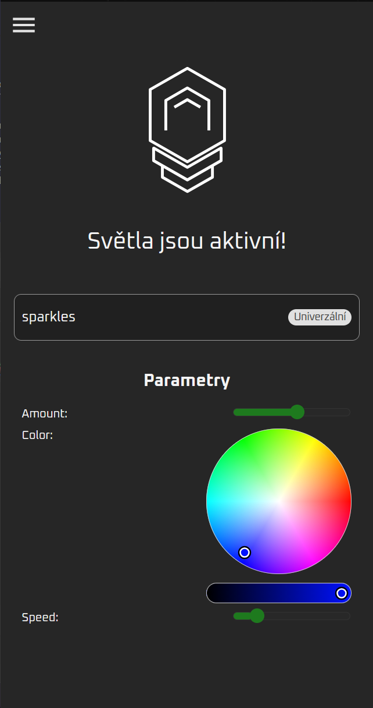
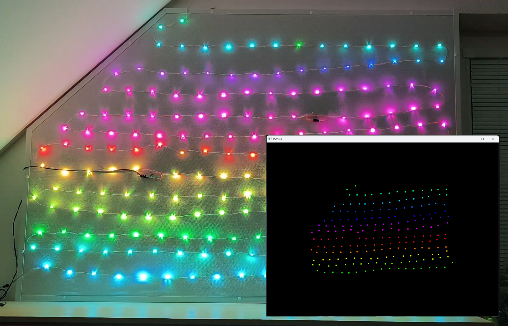
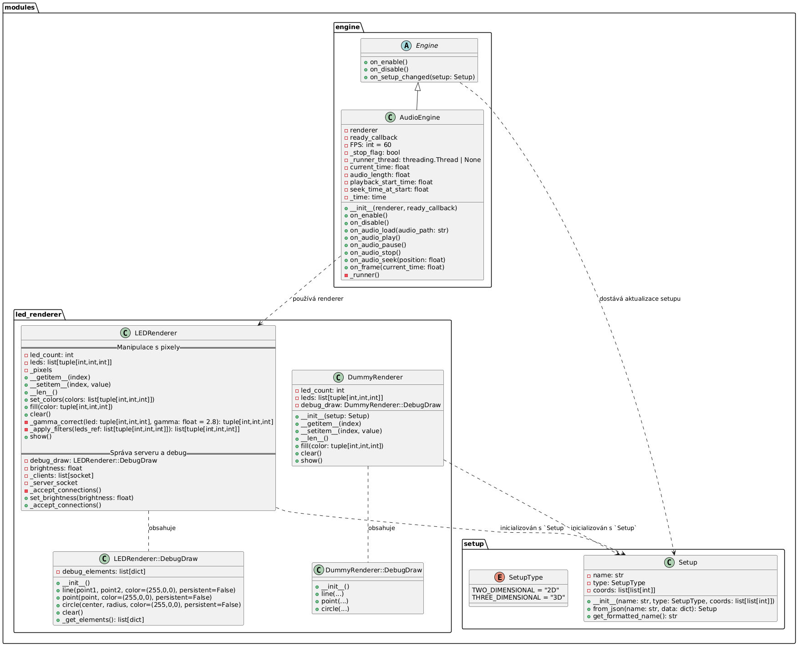
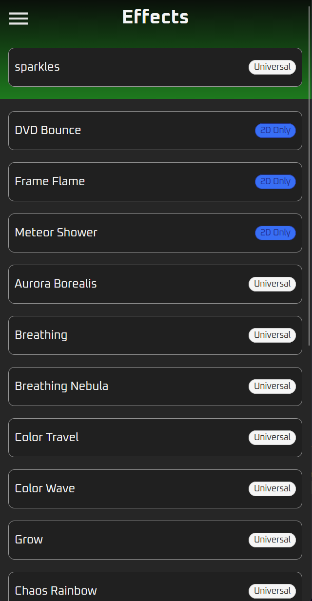
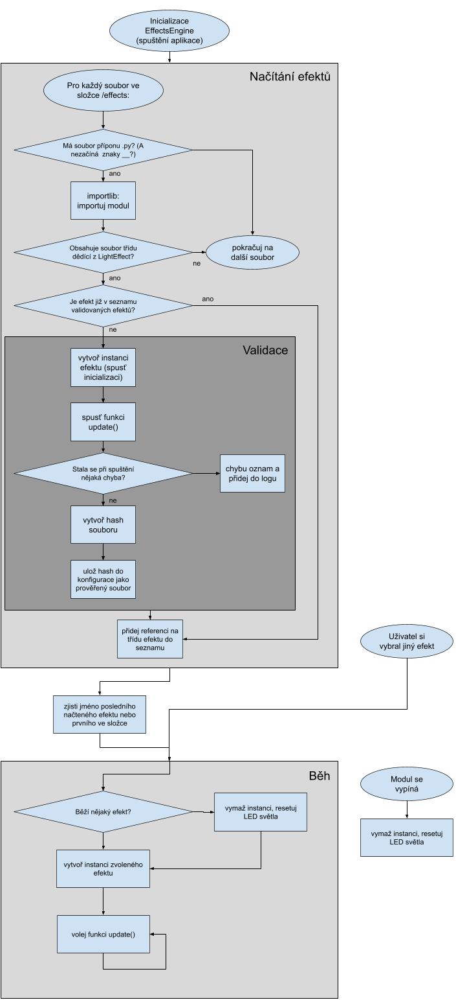
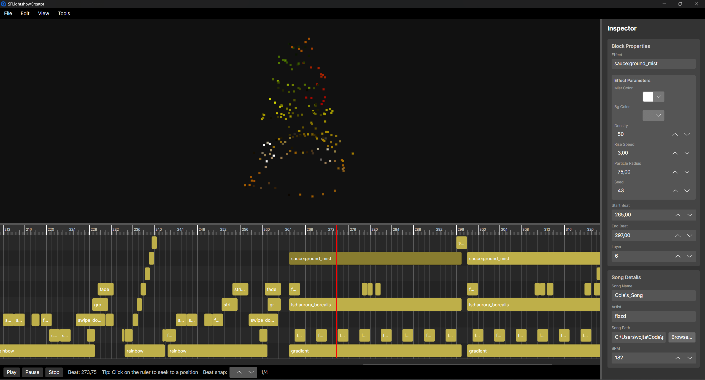
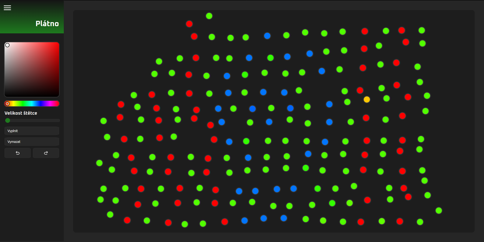
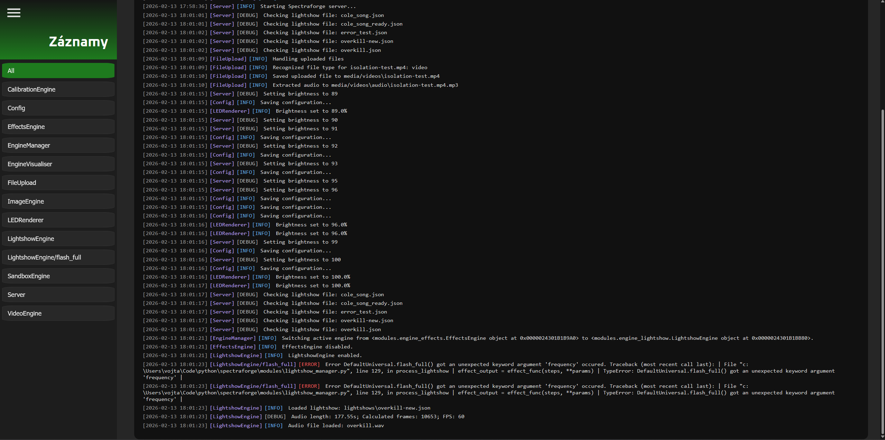
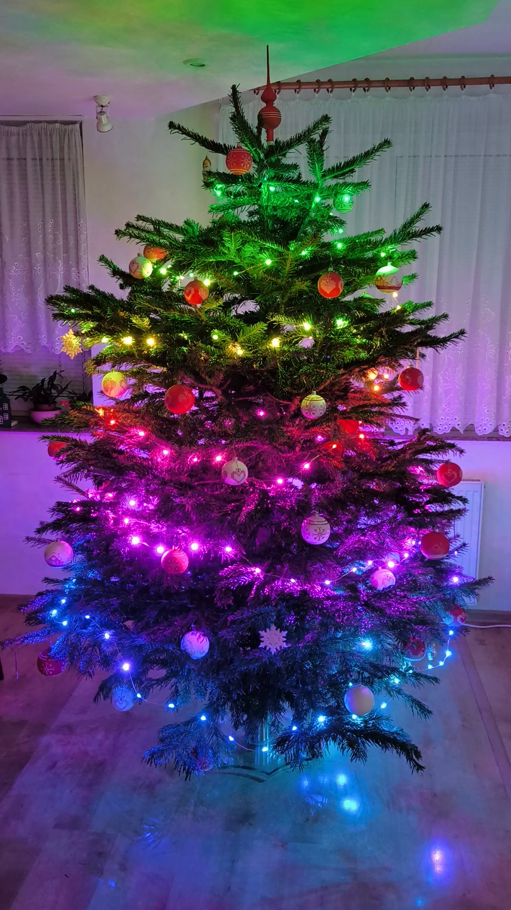

# Praktická část

## 0. Úvod
Spectraforge je software pro řízení adresovatelných LED diod v reálném čase, navržený pro platformu Raspberry Pi. Umožňuje snadné vytváření a přidávání světelných efektů či animací a nabízí sadu dalších způsobů interakce s LED světly - například pomocí zvukových vstupů nebo předem nahraných světelných show. Vše je ovladatelné prostřednictvím webového rozhraní. Světla lze umístit na 3D povrch (například vánoční stromek) nebo do 2D prostoru (například na zeď). Tento software je určen pro umělce, vývojáře a nadšence do světelné techniky, kteří chtějí jednoduše vytvářet a spravovat světelné instalace. Aplikace také obsahuje nástroj pro simulaci LED diod na obrazovce, což usnadňuje vývoj a testování efektů bez nutnosti použití fyzického hardwaru.



## 1. Návod k použití
Tato sekce poskytuje kompletní návod k instalaci, základnímu nastavení, používání a vývoji efektů v prostředí Spectraforge.

### 1.1. Instalace a spuštění
Pro běh aplikace je vyžadován nainstalovaný Python. Vývoj probíhal na verzi 3.10, systém byl však testován i na verzi 3.13 a měl by být kompatibilní i s nejnovější verzí (3.15 k datu psaní této práce). Do cílové složky extrahujte obsah repozitáře, vytvořte virtuální prostředí (doporučeno) a nainstalujte vyžadované moduly ze souboru `requirements.txt`. Po spuštění hlavního souboru `server.py` se aktivuje webový server, který je dostupný na IP adrese zařízení na portu 5000 (adresa je zobrazena v konzoli po spuštění). Pro simulaci LED diod na obrazovce současně spusťte `led_simulator.py`.

Pro nasazení do prostředí s hardwarem na Raspberry Pi je nutné nainstalovat knihovny pro NeoPixel (`pip3 install rpi_ws281x adafruit-circuitpython-neopixel`) zajišťující komunikaci s LED diodami. Aplikace automaticky detekuje, zda běží na Raspberry Pi, a podle toho zvolí správnou vrstvu pro komunikaci s hardwarem. Doporučuje se také nastavit automatické spuštění aplikace po startu systému, například pomocí služby systemd.

### 1.2. Prvotní nastavení
Po prvním spuštění se načtou všechny efekty a automaticky se přehraje první z nich. Jeho zobrazení však nebude správné, dokud neproběhne kalibrace pozic LED diod. 2D rozložení lze kalibrovat přímo v uživatelském rozhraní v sekci "Rozložení". Klikněte na tlačítko "Nové rozložení", zadejte název a počet LED diod. Poté se vám otevřou instrukce, které vás provedou zbytkem procesu: pevně umístěte kameru co nejvíce kolmo k rovině instalace, stiskněte tlačítko začít a vydržte, než se vyfotí obrázky všech diod. Poté vám aplikace bude postupně prezentovat  ⚠️⚠️ [Doplnění 3D kalibrace]

### 1.3. Základní ovládání
Po úspěšném nastavení rozložení LED diod se vraťte na hlavní stránku. Zde můžete upravovat parametry aktuálního efektu, jako je rychlost, barva nebo intenzita (pokud to daný efekt podporuje). Kliknutím na název efektu nebo na tlačítko "Efekty" v navigačním menu přejdete na stránku s výběrem efektů. Zde můžete procházet dostupné efekty seřazené dle vhodnosti pro dané rozložení (2D/3D). Kliknutím efekt zvolíte jako aktuální.

Nové efekty lze přidávat v sekci "Nahrát", kde můžete procházet soubory na vašem zařízení a nahrát je na server. Podporovány jsou Python skripty (efekty), audio soubory (vizualizér), obrázkové a video soubory (zobrazení na LED diodách) a předem naaranžované světelné show ve formátu JSON. Všechny tyto funkce jsou dostupné v hlavním menu.

### 1.4. Vývoj vlastních efektů
Pro vývoj vlastních efektů je nutná základní znalost jazyka Python. Efekty jsou implementovány jako samostatné moduly, které dědí ze třídy `LightEffect`. Pro vytvoření nového efektu stačí založit nový soubor ve složce `effects` a implementovat následující strukturu:

Třída musí obsahovat konstruktor přijímající dva parametry - `renderer` a `coords`. Musí také volat konstruktor nadtřídy, kterému předá `renderer`, `coords`, název efektu pro zobrazení v aplikaci a typ efektu (Pouze 2D/3D, Vhodnější pro 2D/3D nebo Univerzální). Dále musí obsahovat metodu `update()`, jež je volána v cyklu a definuje chování efektu. Barvy jednotlivých LED diod (často nazývaných pixely) jsou dostupné pomocí indexace objektu `self.renderer`. Pro jejich zobrazení je nutné zavolat `self.renderer.show()`. Pozice LED diod v prostoru jsou uloženy v seznamu `self.coords` ve formátu XYZ souřadnic (v režimu 2D je osa Z definovaná pro zajištění kompatibility s 3D efekty hodnotou 0).

#### 1.4.1. Parametry
Chcete-li přidat parametry měnitelné z aplikace, použijte metodu `add_parameter()`. Ta vrací objekt parametru, jehož aktuální hodnotu získáte metodou `get()`. Hodnoty parametrů jsou perzistentní a ukládají se do konfiguračního souboru. Při inicializaci je nutné zadat název, typ parametru (číselný posuvník, výběr barvy, přepínač ano/ne, tlačítko) pomocí enumeračního typu `ParameterType` a výchozí hodnotu. Posuvník navíc vyžaduje hodnoty `min`, `max` a `step` (float nebo int). Tlačítka mohou přijímat argument `onClick` (funkce volaná při kliknutí), případně argumenty `onDown` a `onUp` pro funkce volané samostatně při stisknutí a uvolnění.

#### 1.4.2. Vývojové nástroje a omezení
Pro vývoj efektů se doporučuje používat režim pískoviště (sandbox mode) dostupný v navigačním menu. Tento režim umožňuje automatické načtení změn při uložení souboru (hot-reloading) bez nutnosti restartovat server. Pro využití tohoto režimu přesuňte efekt do složky `sandbox`.

Je třeba zmínit několik omezení a okolností pro správný vývoj:

- Funkce `update()` je volána tak často, jak to dovolí výkon zařízení, namísto pevné snímkovací frekvence (FPS). Ačkoliv je omezení frekvence a zavedení "časovače" standardním postupem, většina efektů těží z maximální plynulosti. Chování by mělo být škálováno parametrem rychlosti.

- Osy jsou definovány následovně: X - šířka, Y - výška, Z - hloubka. Ačkoliv bývá zvykem používat pro výšku osu Z, v tomto systému je výškou vždy osa Y kvůli kompatibilitě mezi 2D a 3D režimem, což bývá standardní praxí v herních enginech.

- Efekty mohou blokovat svůj chod (např. pomocí `time.sleep()`), jelikož běží v samostatném vlákně. Náročné výpočty by však měly být optimalizovány, aby nedocházelo ke snížení celkové snímkovací frekvence.

- Souřadnice v `self.coords` nejsou normovány a mohou nabývat libovolného rozsahu či měřítka (včetně záporných hodnot). Pro výpočty vzdáleností a rychlostí se doporučuje používat relativní hodnoty (poměry) místo absolutních.

#### 1.4.3. Příklad efektu
Níže je uveden příklad jednoduchého efektu "duha", využívající barevný model HSV pro plynulé přechody barev, s parametry pro nastavení rychlosti a směru.
```python
class Rainbow(LightEffect):
    def __init__(self, renderer, coords):
        super().__init__(renderer, coords, "Rainbow", EffectType.UNIVERSAL)
        # inicializace parametrů
        self.speed = self.add_parameter("Speed", ParamType.SLIDER, 1, min=1, max=20, step=0.1)
        self.reverse = self.add_parameter("Reverse", ParamType.CHECKBOX, False)
        self.current_y = 0  # hodnota sledující aktuální posun

    def update(self):
        self.current_y += (-1 if self.reverse.get() else 1) * self.speed.get() / 10  # aktualizace posunu, ovlivněno rychlostí a směrem
        if self.current_y > self.height:
            self.current_y = 0
        for i in range(len(self.renderer.leds)):
            # výpočet barvy na základě pozice a aktuálního posunu
            normalized_rgb = list(colorsys.hsv_to_rgb(mu.normalize(mu.wrap(self.coords[i][1] - self.current_y, 0, self.height), 0, self.height), 1, 1))
            # nastavení barvy LED diody
            self.renderer.leds[i] = tuple([int(channel * 255) for channel in normalized_rgb])
        self.renderer.show()
```

## 2. Zjišťování pozic LED v prostoru
Většina efektů a funkcí v aplikaci závisí na znalosti přesných pozic LED diod v prostoru. Tyto souřadnice jsou klíčové pro výpočty vzdáleností, směrů a dalších prostorových vlastností, které umožňují vytvářet efekty reagující na 3D uspořádání instalace.

2D rozložení lze kalibrovat pomocí chytrého telefonu. Proces využívá modul `CalibrationEngine`, který prostřednictvím kamery snímá jednotlivé rozsvícené LED diody. Před zahájením je nutné zajistit v místnosti dostatečnou tmu pro vysoký kontrast a kameru zafixovat kolmo k povrchu. Program následně analyzuje pořízené snímky a detekuje pozici diody podle nejjasnějšího bodu. Ačkoliv existují i jiné metody (např. detekce barvy nebo Houghova transformace pro detekci kruhů), detekce nejjasnějšího bodu byla zvolena pro svou jednoduchost. Kvůli možným nepřesnostem jsou detekované pozice v aplikaci předloženy uživateli ke kontrole a případné manuální úpravě. Finální souřadnice se uloží do souboru pro pozdější použití.

Získání pozic ve 3D instalaci je složitější, princip však zůstává stejný. Je nutné pořídit fotografie alespoň ze dvou různých úhlů, ideálně navzájem kolmých. Tento program vyžaduje fotografie ze všech čtyř stran (přední, zadní, levá, pravá) pro vyšší přesnost. Vzhledem k nižší spolehlivosti automatické detekce ve 3D není tento režim integrován přímo v aplikaci. ⚠️⚠️

## 3. Zobrazování barev na LED diodách
Zobrazování barev zajišťuje samostatná vrstva `LEDRenderer`, která jako jediná komunikuje přímo s hardwarem. Tento přístup umožňuje snadný post-processing (filtry) na jednom místě a jednoduchou rozšířitelnost, například podporu jiných LED architektur bez nutnosti zásahů do zbytku kódu. Třída `LEDRenderer` je instancována v `server.py` a předávána jednotlivým modulům.

Jedná se o lehký obal (wrapper) nad knihovnou neopixel, který zachovává podobnou syntaxi. Implementuje metody `__getitem__` a `__setitem__` pro přímé indexování objektu rendereru jako seznamu pixelů, a funkce jako `fill` a `clear`. Pro odeslání dat na diody je nutné zavolat metodu `show()`. Automatické odesílání po každé změně pixelu by bylo nežádoucí z důvodu vysoké výkonové náročnosti. Modul obsahuje také třídu `DummyRenderer`, která neobsahuje žádnou logiku, sloužící pouze jako rozhraní pro validaci efektů (viz kapitola o vývoji efektů).

### 3.1. Simulace LED diod na obrazovce
Pro usnadnění vývoje a testování bez fyzického hardwaru obsahuje aplikace simulátor. Ten zobrazuje LED diody jako barevné body na černém pozadí, jejichž pozice odpovídají kalibrovaným souřadnicím. Simulátor je implementován v `led_simulator.py`. Při detekci OS Windows se automaticky spustí server, na který se klient připojí a začne odesílat data o barvách. Toto řešení umožňuje nezávisle ukončovat simulátor a server.




#### 3.1.1. DebugDraw
Většina efektů využívá složité matematické výpočty. Pro usnadnění ladění (debugging) nabízí simulátor nástroj `DebugDraw` pro kreslení základních geometrických tvarů (body, čáry, kruhy) přímo do simulátoru. Funkce se volají přes `renderer.debug_draw.point / line / circle`. Ty vyžadují souřadnice (n-tice/tuple), barvu v RGB a volitelný parametr určující, zda má tvar zůstat vykreslen i po dalším volání `show()` (hodnota `persistent`).

### 3.2. Post-processing a filtry
Post-processing, tedy úprava obrazu po jeho vygenerování, je velmi důležitá část vykreslovacího cyklu. Umožňuje aplikovat globální úpravy před odesláním na diody. V aplikaci jsou implementovány filtry pro:

- Ovládání jasu: vynásobí hodnoty všech barevných kanálů nastaveným koeficientem (procentem jasu).
- Posun barev (Hue shift): posune všechny barvy na spektru o zadanou hodnotu. Poskytuje dodatečný způsob přizpůsobení efektů, které neobsahují parametry pro změnu barev.
- Gamma korekce: nejdůležitější filtr, který upravuje jas středních tónů pro kompenzaci nelineárního vnímání jasu lidským okem. Je kritický pro dosažení sytých a přirozených barev. ⚠️⚠️

## 4. Modulární struktura (`Engine`)
Pro jednoduchou rozšiřitelnost, organizaci kódu a zajištění, že pouze jeden modul je aktivní a může ovládat LED diody, je celá funkcionalita rozdělena do modulů, které jsou spravovány třídou `EngineManager`. Každý modul dědí z třídy `BaseEngine`, která definuje základní rozhraní a chování pro všechny moduly. Přesněji řečeno se jedná o funkce `on_enable()`, `on_disable()`, které jsou volány při aktivaci a deaktivaci modulu, a dekorátor `@requires_active`, který zajišťuje, že funkce proběhne pouze, pokud je modul aktivní. Mimo tyhle komponenty je každý engine modul obyčejná třída, která může obsahovat libovolné funkce a data pro implementaci své funkcionality, které mohou být spuštěny i bez dekorátoru na pozadí. Je nutno podotknout, že aktivní stav modulu má spíše informativní charakter, jelikož špatně naprogramovaný modul by mohl posílat požadavky do vykreslovače, i kdyby nebyl aktivní.

### 4.1 `EngineManager`
Manažer engine modulů, `EngineManager`, je zodpovědný za správu všech modulů, včetně jejich aktivace, deaktivace a přepínání mezi nimi. Udržuje seznam všech dostupných modulů, který je vytvořen při postupném volání funkce `register_engine()` z každého modulu, který následně spouští funkce `on_enable()` a `on_disable()` a kontroluje aktivní stav modulu při volání funkcí dekorovaných `@requires_active`. Tento přístup umožňuje snadné přidávání nových modulů bez nutnosti měnit stávající kód, protože každý modul se stará pouze o svou vlastní funkcionalitu a manažer se stará o jejich správu a koordinaci. [🎨🎨 doplnit diagram engine správy]



## 5. Systém efektů
Jak již bylo zmíněno dříve, efekty jsou vytvářeny jako samostatné Python skripty dědící z třídy `LightEffect`. Celý systém efektů je řízen modulem `EffectsEngine`, který slouží jako most mezi jednotlivými efekty a zbytkem aplikace.



### 5.1 Dynamické načítání scriptů
Efekty jsou načítány dynamicky při startu serveru pomocí modulu `importlib`. Funkce `load_effects()` prochází složku `effects/`, načítá všechny Python skripty a kontroluje, zda-li obsahují třídu dědící z `LightEffect`.

```python
def load_effects(self, folder="effects"):
    Log.info("EffectsEngine", "Loading and validating effects...")
    self.effects = {}
    for filename in os.listdir(folder):
        if filename.endswith(".py") and not filename.startswith("__"):
            module_name = filename[:-3]
            module = importlib.import_module(f"{folder}.{module_name}")
            for attr in dir(module):
                cls = getattr(module, attr)
                if hasattr(module, "LightEffect") and isinstance(cls, type) and \
                   issubclass(cls, module.LightEffect) and cls is not module.LightEffect:
                    thrown_exception = self.validate_effect(cls)
                    if thrown_exception is None:
                        self.effects[module_name] = cls
```

Důležitou součástí je validace. Každý efekt je před registrací otestován spuštěním s využitím `DummyRenderer`, což zrychlí odhalení chyb v kódu a zlepší UX (uživatelský zážitek) odstraněním nefunkčních efektů z nabídky. Pro optimalizaci startu se využívá cachování - pokud se hash souboru shoduje s validním záznamem v cache, validace se přeskočí.




### 5.2. Nevýhody (bezpečnostní rizika)
Dynamické spouštění Python kódu přináší bezpečnostní rizika. Soubory ve složce `effects/` jsou spouštěny s právy aplikace a škodlivý kód by mohl číst soubory, spouštět příkazy či manipulovat se sítí. Tento přístup je akceptovatelný pouze v důvěryhodném prostředí. Pro produkční nasazení by bylo nutné implementovat sandboxing (např. `RestrictedPython` nebo Docker).

## 6. Webové rozhraní
Webové rozhraní je primární způsob interakce uživatele s aplikací. Pro backend se využívá knihovny Flask se značnou částí vykreslování na straně serveru (server-side rendering) pomocí systému Jinja2 a klasický HTML/CSS/JavaScript bez frameworků pro frontend. Pro komunikaci v reálném čase, jako je kalibrace nebo ovládání audio přehrávače (více v kapitole 7), se používají WebSockets implementované pomocí Socket.IO.

### 6.1 Flask API (HTTP requesty)
Backend je postaven na frameworku Flask, který poskytuje jednoduchý způsob vytváření webových API. Každý engine modul a část aplikace má své vlastní endpointy pro správu své funkcionality. Například:

**Správa efektů:**
- `GET /api/get_state` - Vrací aktuální stav (aktivní efekt a jeho parametry)
- `POST /api/set_effect` - Nastaví aktivní efekt
- `GET /api/get_parameters/<effect_name>` - Vrací seznam parametrů daného efektu
- `POST /api/set_parameter` - Nastaví hodnotu parametru aktuálního efektu

**Správa rozložení:**
- `POST /api/change_setup` - Přepne aktivní rozložení LED diod
- `POST /api/calibration/new_setup` - Vytvoří nové rozložení
- `POST /api/calibration/show_pixel` - Rozsvítí konkrétní LED při kalibraci

**Získání dat:**
- `GET /api/get_audio_files` - Seznam dostupných audio souborů
- `GET /api/get_image_files` - Seznam dostupných obrázků
- `GET /api/get_video_files` - Seznam dostupných video souborů

Všechny endpointy vrací data ve formátu JSON pro snadnou manipulaci v JavaScriptu. Pro operace vyžadující, aby byl konkrétní engine aktivní, se automaticky kontroluje stav pomocí dekorátoru `@EngineManager.requires_active`.

### 6.2 Nahrávání souborů (audio, video, lightshow)
Pro nahrávání souborů je implementován samostatný modul `upload_files.py`, který zpracovává multipart form data z prohlížeče. Nahrávání podporuje více souborů najednou a automaticky je třídí podle typu:

- **Audio soubory** (.mp3, .wav, .ogg) → `audio/`
- **Video soubory** (.mp4, .avi, .mov, .mkv) → `media/videos/`
- **Obrázky** (.png, .jpg, .jpeg) → `media/images/`
- **Lightshow soubory** (.json) → `lightshows/`
- **Python skripty** (.py) → `effects/`

Endpoint `/api/upload` přijímá POST request s přiloženými soubory a vrací JSON odpověď s výsledkem operace. Pro uživatelské pohodlí je možné přetáhnout soubory přímo do okna prohlížeče (drag & drop) na stránce `/upload`.

## 7. Efekty založené na zvuku
Audio funkcionalitu zajišťuje třída `AudioEngine`, která rozšiřuje základní `Engine` o metody pro synchronizaci a přehrávání.

### 7.1. Zpracování zvukového souboru AudioEngine
Třída `AudioEngine` poskytuje rámec pro moduly pracující se zvukem. Obsahuje vlákno s cyklem (`runner`) spouštějící hlavní funkci pro vykreslení efektu `on_frame` a hlavně definuje metody pro zpracování událostí životního cyklu přehrávání:

- `on_audio_load(audio_path)` - Voláno při požadavku načtení audio souboru. Přijimá referenci na soubor ve formě cesty a zde dává prostor pro načtení a zpracování souboru. Po úspěšném zpracování musí modul ohlásit připravenost voláním callback funkce poskytnuté jako argument při inicializaci.
- `on_audio_play()` - Voláno při spuštění přehrávání. Spustí interní runner thread.
- `on_audio_pause()` - Voláno při pozastavení. Zastaví runner thread.
- `on_audio_stop()` - Voláno při zastavení. Vyčistí pixely a resetuje pozici.
- `on_audio_seek(position)` - Voláno při skoku na jinou pozici v souboru.
- `on_frame(current_time)` - Volá se každý snímek během přehrávání s aktuálním časem.

Samotné přehrávání audio probíhá v prohlížeči pomocí HTML5 `<audio>` prvku. Server pouze přijímá WebSocket zprávy o změnách stavu přehrávání (play, pause, seek) a reaguje na ně spuštěním příslušných metod v `AudioEngine`. Toto řešení má několik výhod:

- Server (Raspberry Pi) nepotřebuje audio výstup.
- Nižší zátěž serveru a latence.
- Uživatel má možnost jednoduše ovládat hlasitost a přehrávání v uživatelském rozhraní.

Narozdíl od standartního `EffectEngine` je `AudioEngine` navržen pro chod ve specifických snímkových intervalech (30, 60 nebo 120 FPS na základě nastavení výkonu), protože synchronizace s hudbou je důležitější než maximální plynulost, a zároveň je potřeba dát dostatek času pro zpracování dat a odeslání na LED diody.


### 7.2. Synchronizace světel se zvukem
Pro přesnou synchronizaci se využívá monotonický časovač (`time.monotonic()`), který zajišťuje konzistentní měření času bez ohledu na změny systémového času. Vlákno na pozadí (daemon thread) cyklicky volá metodu `on_frame()` s aktuálním časem přehrávání.

```python
def _runner(self):
    while not self._stop_flag:
        elapsed = self._time.monotonic() - self.playback_start_time
        self.current_time = self.seek_time_at_start + elapsed

        if self.current_time >= self.audio_length:
            break

        self.on_frame(self.current_time)
        
        self._time.sleep(1 / self.FPS)
```

### 7.3 Příklad modulu: `VisualizerEngine`
`VisualiserEngine` je implementace automatické audio vizualizace. Využívá FFT (Fast Fourier Transform) analýzu pro rozklad zvuku na frekvenční spektrum a následné zobrazení jako barevné pruhy na LED diodách.

Proces zpracování:
1. **Načtení audio** - Audio soubor je načten pomocí knihovny pro zpracování zvuku
2. **FFT analýza** - Celý soubor je rozdělen na okna a pro každé okno se vypočítá frekvenční spektrum
3. **Předvýpočet snímků** - Pro každý časový snímek (60 FPS) se předpočítá, jaké barvy by měly LED mít
4. **Signalizace připraveného stavu** - Zavolá `ready_callback`, čímž prohlížeč dostane zprávu `audio_ready`
5. **Přehrávání** - Metoda `on_frame()` pouze čte předpočítaná data a odesílá je do vykreslovače

## 8. `LightshowEngine`: Naaranžovaná světelná show
`LightshowEngine` umožňuje vytvářet komplexní, časově synchronizované světelné představení kombinací více efektů na timeline. Na rozdíl od `VisualizerEngine`, který automaticky reaguje na zvuk, lightshow poskytuje plnou manuální kontrolu nad tím, kdy a jak se efekty přehrávají.

### 8.1 Formát souboru
Lightshow je uložena jako JSON soubor s následující strukturou:

```json
{
  "song_name": "Název skladby",
  "song_artist": "Jméno interpreta",
  "song_path": "cesta\\k\\audio\\souboru.mp3",
  "bpm": 182,
  "timeline": [
    {
      "effect": "sauce:sparkle",
      "parameters": {
        "percentage": 30,
        "color2": "#FFFFFF00"
      },
      "start": 4,
      "end": 5,
      "layer": 0
    }
  ]
}
```

Hlavní časti jsou metadata o skladbě (název, interpret, cesta k audio souboru, BPM) a pole `timeline`, které obsahuje jednotlivé efekty s jejich parametry, časem začátku a konce v taktech a vrstvou, na které se mají přehrávat. Implementován je také systém vrstev, který umožňuje efektům se překrývat a být zobrazeny současně. Efekty na vyšší vrstvě budou vykresleny nad efekty na nižších vrstvách, zárověň jsou všechny barvy definované v RGBA formátu (obsahující červenou, zelenou, modrou a alfa kanál pro průhlednost), což umožňuje efektům být částečně průhledné a umožnit vidět efekty pod nimi. Tento systém vrstvení odemyká prakticky neomezené možnosti pro kreativitu a komplexnost světelných show. Příklad použití by bylo například mít plně neprůhledný efekt, na něm vrstvu s efekty nezakrývající celý prostor, ale pouze část (například jiskry nebo pruh) a nad tím vrstvu s průhlednou bílou barvou pulzující v rytmu hudby pro zvýraznění efektů pod ní či plynulé přechody pomocí efektu přechodu z průhledné do černé a naopak na nejvyšší vrstvě. 

### 8.2 Definice lightshow efektů
Definice efektů pro lightshow je hodně odlišná od efektů pro `EffectEngine`. Každý soubor ve složce `lightshow_effects/` slouží jako balíček efektů s podobným zaměřením definován jako třída dědící z `LightshowEffects`. Každá tahle třída by měla obsahovat dekorátor @namespace("jmeno_jmenneho_prostoru"), který určuje jmenný prostor pro efekty v tomto souboru a je obsažen v referenci efektu v lightshow souborech. Tento přístup byl zvolen, aby se předešlo kolizím názvů efektů mezi různými soubory a aby se daly efekty logicky organizovat do skupin. Inicializační funkce musí také přijímat parametr `coords` obsahující seznam souřadnic LED diod.

Každý efekt je následně definován jako metoda v této třídě s dekorátorem @l_effect(EffectType(Universal/2D/3D)), který určuje, pro jaký typ rozložení světel je efekt určen. Tato metoda musí přijímat parametr `steps`, který určuje počet snímků, který efekt zabírá mezi svým startem a koncem. Dále může přijímat libovolné další parametry pro nastavení efektu, které ale musí obsahovat nápovědu typu (type hint) pro správné zobrazení v editoru lightshow souborů. Metoda musí vracet seznam obsahující seznamy barev pro každou LED diodu pro každý snímek, tedy formátu `List[List[Tuple[int, int, int, int]]]`
Příklad: 

```python
from effects.lightshow_effects import CustomParamType # python neobsahuje vestavěný typ pro reprezentaci barev, proto je vytvořen vlastní CustomParamType.Color, který pracuje jako RGBA tuple pro efekty a jako HEX string v souboru
@namespace("")
class DefaultUniversal(LightshowEffects):
    def __init__(self, coords):
        super().__init__(coords)

    @l_effect(EffectType.UNIVERSAL)
    def fade(self, steps: int, color_from: CustomParamType.Color = Color.white, color_to: CustomParamType.Color = Color.white):
        # lineární interpolace: výpočet posunu mezi každým krokem pro každý kanál
        step_r = (color_to[0] - color_from[0]) / steps
        step_g = (color_to[1] - color_from[1]) / steps
        step_b = (color_to[2] - color_from[2]) / steps
        step_a = (color_to[3] - color_from[3]) / steps

        frames = []
        for step in range(steps):
            # výpočet mezilehlé barvy pro aktuální krok
            intermediate_color = (
                int(color_from[0] + step * step_r),
                int(color_from[1] + step * step_g),
                int(color_from[2] + step * step_b),
                int(color_from[3] + step * step_a),
            )
            frame = [intermediate_color] * len(self.coords) # kopírování stejné barvy pro všechny LED diody
            frames.append(frame)
        return frames
```

Při načítání lightshow se pro každý snímek (podle nastaveného FPS) a pro každou LED vypočítají všechny efekty v dané vrstvě, jdoucí zespoda nahoru, slučující tuto vrstvu do vrstev níže umístěných. Tyto předpočítané snímky jsou uloženy v paměti jako seznam, takže přehrávání je pak jen čtení z tohoto seznamu - extrémně rychlé.

````python
self.frames = process_lightshow(self.registry, data, LightshowSettings(self.FPS))
self.audio_length = len(self.frames) / self.FPS if self.frames else 0
````

Tento přístup umožňuje přehrávat i velmi složité lightshow s desítkami vrstev a efektů bez záseků, protože veškerá výpočetní náročnost je přesunuta do fáze načítání.

### 8.3 Výroba lightshow
Ruční zápis efektů do JSON souboru není reálně proveditelný pro synchronizaci s hudbou, proto už od začátku vývoje byl využit vizuální editor. První způsob používal populární software pro úpravů audio souborů - Audacity, specificky jeho funkci pro přidávání značek (labels) do časové osy a export těchto značek jako CSV souboru. Tento CSV soubor byl následně zpracován Python skriptem, který na základě značek a jejich časů generoval lightshow soubor. Tento přístup byl funkční, ale ne příliš uživatelsky přívětivý, protože vyžadoval manuální zápis jmen a parametrů efektů bez výběrů ze seznamů či nápověd v editoru. Proto byl vytvořen vlastní vizuální editor pro lightshow, který umožňuje načíst audio soubor, nastavit tempo (BPM) a přidávat efekty přímo na časovou osu pomocí grafického rozhraní podobající se video editorům. Editor je naprogramovaný v jazyce C# pomocí .NET a frameworku Avalonia pro rozhraní. Díky knihovně Python.NET editor komunikuje s instalací Spectraforge, aby mohl načítat dostupné efekty a jejich parametry. Editor si z konfigurace načítá i rozložení LED diod, aby mohl zobrazovat náhled efektů přímo na modelu instalace. Po každém uložení se lightshow přepočítá a aktualizuje náhled v editoru, což umožňuje okamžitou ukázku výsledku. (Editor není součástí této maturitní práce)



## 9. Další příklady engine modulů

### 9.1. CanvasEngine
Transformuje instalaci na interaktivní plátno. Uživatel ve webovém rozhraní kliká na body reprezentující LED diody a mění jejich barvu. Engine pouze udržuje stav pole barev a poskytuje metody pro čtení a zápis.



```python
def get_pixels(self):
    return self.state

def set_pixels(self, pixel_list):
    if len(pixel_list) != len(self.renderer):
        return
    self.state = pixel_list
    for pix in range(len(self.renderer)):
        self.renderer[pix] = self.state[pix]
    self.renderer.show()
```

### 9.2 `VideoEngine`
`VideoEngine` umožňuje přehrávat video soubory na LED instalaci. Video je rozloženo do prostoru podle pozic LED diod - každá LED zobrazuje barvu pixelu, který se nachází na její pozici ve videu.

Nejdříve je třeba implementovat systém pro zobrazení obrázku na LED instalaci. Tento projekt obsahuje modul `display_utils.py`, který poskytuje funkci `map_image_to_leds(image, coords)`, která vezme 2D obraz formátu knihovny Pillow se seznamem souřadnic LED diod a vrátí seznam barev pro každou LED diodu podle barvy pixelu na pozici LED v obrázku. Funkce hledá nejbližší pixel v obrazu pro každou LED diodu a použije jednoduché vzorkování pomocí box filtru (průměr barev pixelů v okolí LED diody) pro hladší a výstižnější zobrazení. Tato funkcionalita umožňuje zobrazit libovolný obrázek na LED instalaci, i když rozlišení LED diod je mnohem nižší než rozlišení videa. Pro přehrávání videa se tento proces opakuje pro každý snímek videa, čímž se vytvoří animace, společně s audio stopou pro synchronizaci. Posun ve videu se dá ovládat pomocí <audio> prvku poskytnutý modulem AudioEngine.

`VideoEngine` tudíž dědí z `AudioEngine`. Vzhledem k výpočetní náročnosti práce s video soubory, audio část je extrahována předem již při nahrávání videa pomocí podstránky pro nahrávání souborů, která využívá FFmpeg pro extrakci audio stopy z videa a uložení jako samostatný MP3 soubor. Video soubor je při načítání zpracován pomocí knihovny ImageIO, která je lehčí a efektivnější oproti jiným knihovnám, a pro každý snímek se zavolá funkce ze zmiňovaného `display_utils.py` pro získání barev pro LED diody. Tyto barvy jsou uloženy v paměti jako seznam snímků, které se pak během přehrávání pouze čtou a odesílají na LED diody.

Nevýhodou je vysoká spotřeba paměti při delších videích, protože každý snímek musí být uložen v paměti. Pro video v délce 3 minuty při 30 FPS a 200 LED to představuje cca 10 MB RAM (3×60×30×200×3 bajtů).

## 10. Config, logování, cache
### 10.1 Config
Konfigurace celého projektu je uložena v souboru config/server_config.json, který obsahuje nastavení pro různé části aplikace, jako je poslední zapnutý efekt, všechny hodnoty z nastavení, aktuální rozložení LED diod a zvolené hodnoty pro všechny parametry efektů. Tento soubor je načítán při startu serveru a spravován modulem `config_manager.py`, který poskytuje funkce pro získání a aktualizaci jednotlivých nastavení. Data ze souboru jsou uchovány v instanci třídě Config, která je implementována jako singleton, což zajišťuje, že všechny části aplikace pracují se stejnou jedinou instancí konfigurace. Modul je velmi jednoduchý, umožňuje interakci s daty přímo ve slovníku `Config().config[]` a vyžaduje explicitní volání `Config().save()` pro uložení změn do souboru. Na ukládání a načítání používá modul vestavěnou knihovnu `json` pro práci s JSON formátem. 

### 10.2 Logování
Pro sledování chodu aplikace a usnadnění ladění je implementován vlastní systém logování v modulu `log_manager.py`. Modul je staticky implementován, proto umožňuje volat funkce pro logování z libovolné části kódu bez nutnosti předávání instance loggeru. Logovací funkce (info, warn - varování, error - chyba, debug - zpráva pro ladění) přijímají název zdroje (například název modulu nebo funkce) a zprávu, kterou chtějí zalogovat. Logy jsou ukládány do složky logs s názvem souboru odpovídajícím datu a času spuštění serveru. Každý log obsahuje časovou značku, úroveň logu, název zdroje a samotnou zprávu. Frontend také poskytuje zobrazení logů, barevně označené a filtrovatelné podle zdroje. Vše je samozdřejmě viditelné v konzoli pro snadný přístup během vývoje.



### 10.3 Cache
Jeden z nejdůležitějších optimalizačních mechanismů je bez pochyby cache. Vzhledem k tomu, že některé operace, jako je validace efektů nebo načítání lightshow, mohou být velmi náročné na výkon, implementoval jsem systém cache pro ukládání výsledků těchto operací. Modul `caching.py` umožňuje ukládání a čtení souborů podle jména, které jsou modulem ukládány do složky `.cache/`. Soubory mají stanovenou příponu .cache, ale jsou to jednoduché textové soubory a data jsou do nich ukládána ve formátu JSON pro snadnou manipulaci. Nejvýznamnější využití cache je při načítání efektů, kde se ukládá seznam hashů ověřených efektů.

## 11. Závěr a budoucí rozvoj



### 11.1 Shrnutí dosažených cílů
Projekt Spectraforge úspěšně implementuje komplexní systém pro řízení adresovatelných LED diod s následujícími klíčovými funkcemi:

**✅ Realizováno:**
- Plně funkční webové rozhraní pro ovládání z mobilních zařízení i desktopu
- Systém pro automatickou kalibraci pozic LED v 2D i 3D prostoru
- Dynamické načítání efektů umožňující snadné přidávání nových animací
- Audio vizualizér s real-time FFT analýzou
- Lightshow editor pro tvorbu časově synchronizovaných představení
- Podpora pro přehrávání video obsahu na LED instalaci
- LED simulátor pro vývoj bez fyzického hardwaru
- Modulární architektura založená na engine systému
- Post-processing filtry (jas, gamma korekce)

Aplikace byla úspěšně nasazena na Raspberry Pi Zero 2W a testována s 200 LED diodami ve 3D instalaci (vánoční stromek). Dosahuje stabilní snímkovací frekvence 30-60 FPS i u složitějších efektů, což je dostatečné pro plynulý vizuální vjem.

### 11.2 Možnosti rozšíření (nové hardwarové platformy, ESP32)
Ačkoliv je současná implementace plně funkční, existuje prostor pro budoucí vylepšení:

**Hardwarové rozšíření:**
- **ESP32 podpora** - Portace na mikrokontrolér ESP32 by umožnila levnější a kompaktnější řešení. ESP32 má vestavěné WiFi, podporuje až 8 paralelních RMT kanálů pro řízení LED a spotřebovává řádově méně energie. Implementace by vyžadovala přepsání do C++ (Arduino framework) a zjednodušení webového rozhraní.
- **Více LED pásků paralelně** - Současná implementace podporuje pouze jeden datový pin. Rozšíření o více výstupů by umožnilo řídit tisíce LED současně s rozdělením zátěže.

**Softwarové vylepšení:**
- **Grafický editor pro vytváření efektů** - Místo psaní efektů v Pythonu by bylo možné vytvořit vizuální editor, kde uživatelé mohou vytvářet efekty bez nutnosti programování, podobně jako TouchDesigner nebo Unreal Engine editor grafů.
- **Databáze efektů a lightshow** - Webová stránka pro sdílení a stahování efektů a lightshow vytvořených komunitou.
- **MIDI vstup** - Řízení efektů pomocí MIDI kontrolérů pro live performance.
- **Hardwarové tlačítka** - Podpora pro GPIO tlačítka na Raspberry Pi pro ovládání bez nutnosti webového rozhraní.
- **Rust/C++ core** - Přepsání výkonově kritických částí (renderer, FFT analýza) do rychlejšího jazyka s Python bindings.

Projekt prokázal, že i s omezeným hardwarem je možné vytvořit pokročilý systém pro řízení LED světel s bohatými možnostmi přizpůsobení a rozšíření. Modulární architektura zajišťuje, že jakékoliv budoucí rozšíření lze přidat bez zásahu do stávajícího kódu, což činí Spectraforge vhodnou platformou pro dlouhodobý vývoj a experimentování.